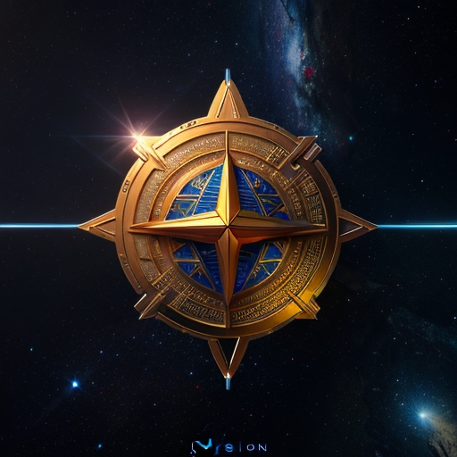

# STARPower

STARPower. A deflationary farm token without a tightly controlled value/collateralization. This token we can issue much more freely for engagement/marketing/partnership campaigns. It's primary utility comes from\
\
1\. Burning the token to mint or stake a STARPower Generator (NFT Vault) to generate an exceptional yield paid not only in STARPower, but also in STARC. \
2\. STARPower can be burned as a method to increase yields for staking other NFT ecosystem assets.\
3\. STARPower is meant to be farmed, rather then traded, as such there is a 1% burn and 1% tax on transfer. \
\
The combination of effects from burning tokens and reducing the maximum supply is designed to eventually balancing the tokens market value.

<figure><figcaption></figcaption></figure>

